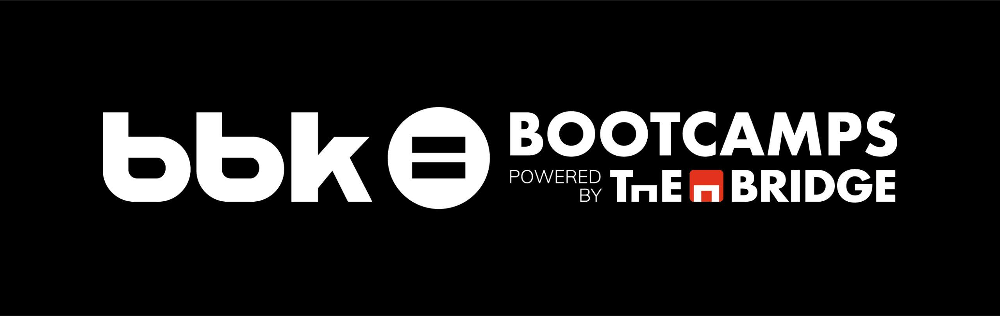

# **Desafío Tripulaciones**
## Reto 2 - Data Science: Modelos de consumo y predicción de gasto mensual.

### <u>Obtención de datos</u>
Los datos se han obtenido mediante **Web Scraping** y **APIs** de páginas web oficiales.

### <u>Entorno de desarrollo</u>
Hemos utilizado **UV** para la creación y gestión del entorno virtual de Python.

#### **Para ejecutar el proyecto:**
+ Para clonar el repositorio: 
```bash
git clone https://github.com/Ebracara/Desafio_Reto2.git
```

+ Para crear y activar el entorno virtual : 

```bash
uv init
```


+ Para instalar las dependencias: 
```bash
uv sync
```


+ Para ejecutar la aplicación localmente: 
```bash
uv run streamlit run app/streamlit_main.py
```

### <u>Base de datos</u>
Utilizamos **PostgreSQL** alojada en **Aiven** y **DBeaver** para establecer y gestionar las conexiones con la base de datos.

### <u>Modelos de predicción</u>
Implementamos dos modelos predictivos de machine learning:

**(1) Modelo 1 - Consumo:** Se consideró el tipo de vehículo y las rutas realizadas, incluyendo los kilómetros recorridos.

**(2) Modelo 2 - Gastos:** Se predijo el precio del carburante. El gasto final se obtuvo multiplicando el consumo medio obtenido en el modelo 1 por la predicción del precio del modelo 2.

### <u>Desarrollo</u>
+ Utilizamos **FastAPI** para gestionar las peticiones y servir las predicciones de los modelos.

+ Desarrollamos una interfaz interactiva con **Streamlit** para facilitar la interacción con los modelos de forma intuitiva y visual.

### <u>Despliegue</u>
Para el despliegue, contenerizamos la aplicación usando **Docker**, incluyendo tanto [FastAPI](https://desafio-reto2.onrender.com/docs) como [Streamlit](https://desafio-reto2-1.onrender.com/) en el mismo contenedor. El contenedor Docker fue desplegado en la nube utilizando [Render](https://render.com/).


### <u>Equipo</u>
+ [Esther Begoña](https://www.linkedin.com/in/estherbego%C3%B1a/)
+ [Jaime Relea](https://www.linkedin.com/in/jrsmf/)
+ [Omar Mourabit](https://www.linkedin.com/in/8xbit/)
+ [Jhon Anthohy Quiliche](https://www.linkedin.com/in/anthonyquili/)
+ [Isa Escribano](https://www.linkedin.com/in/isa-escribano-g%C3%B3mez-a215a611b/)
